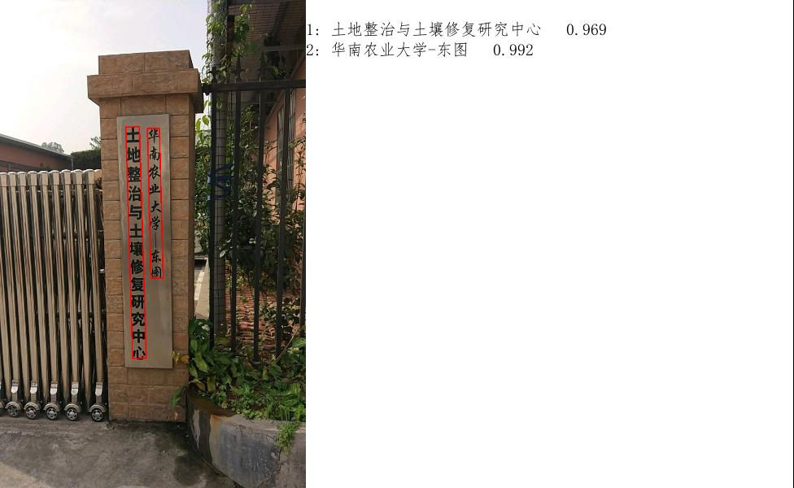
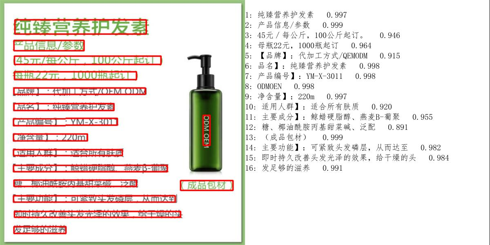
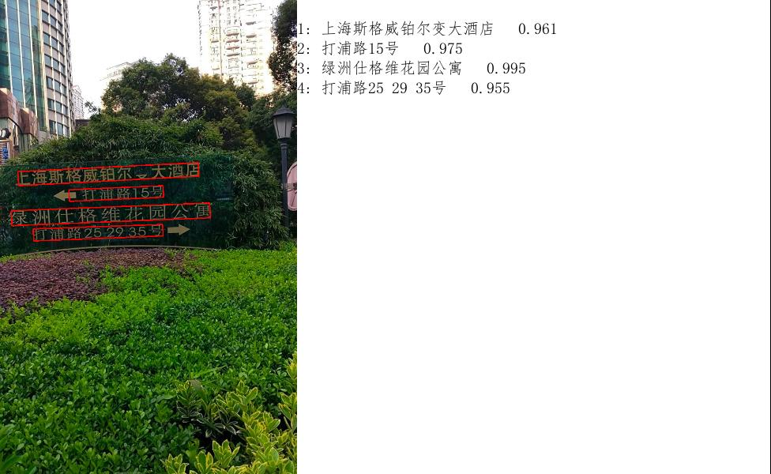

English | [简体中文](./Readme_cn.md) |
# If you find it useful, please give it a Star.
# ONNXOCR
#### Universal OCR, supporting inference in over 80 languages.
Version Update
The PPOCRv4 model converted to an ONNX model for inference achieves higher accuracy and performance, with the inference speed being 5 times faster than using the PaddlePaddle framework.

Advantages:
1.Independent from deep learning training frameworks, it is a general OCR that can be directly deployed.
2.In situations where computational power is limited and accuracy remains unchanged, the PaddleOCR is converted into an ONNX model, which has been 3.reconstructed as an OCR model that can be deployed on computers with ARM architecture and x86 architecture.
4.On computers with equivalent performance, the inference speed has been accelerated by 4-5 times.

Effect Display

    <figure style="margin: 0 10px;">
        
        <figcaption style="text-align: center;">我的微信</figcaption>
    </figure>
    <figure style="margin: 0 10px;">
        
        <figcaption style="text-align: center;">QQ群</figcaption>
    </figure>

## 写在最后
我喜欢开源，喜欢AI技术，因为我认为开源和AI会为有需要的人带来方便和帮助，也会让这个世界变得更好。通过对这些项目的捐赠，您可以和我一道让AI为更多人带来温暖和美好。

I like open source and AI technology because I think open source and AI will bring convenience and help to people in need, and will also make the world a better place. By donating to these projects, you can join me in making AI bring warmth and beauty to more people.

支付宝或微信打赏 (Alipay reward or WeChat reward)¶
通过支付宝或者微信给作者打赏，请写好备注。 Give the me a reward through Alipay or WeChat.
<!-- 
 -->

    <figure style="margin: 0 10px;">
        
        <figcaption style="text-align: center;"></figcaption>
    </figure>
    <figure style="margin: 0 10px;">
        
        <figcaption style="text-align: center;"></figcaption>
    </figure>

## Star History

