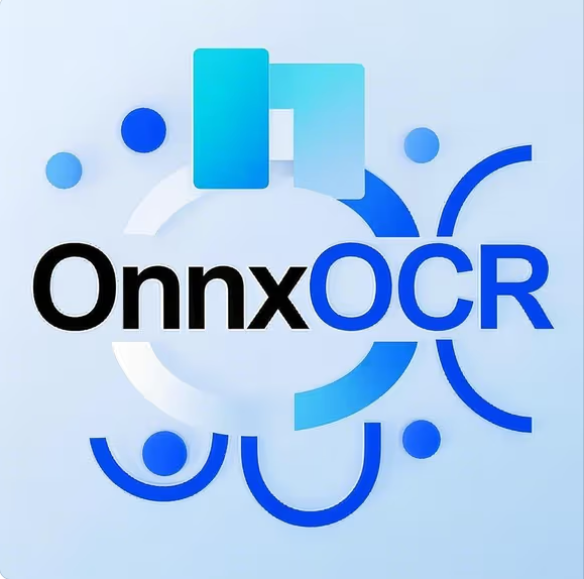
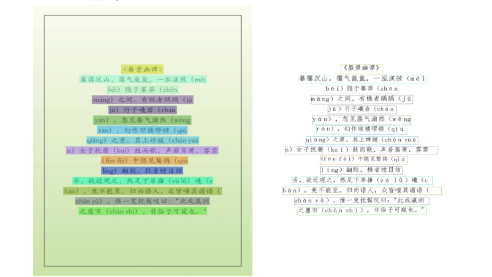
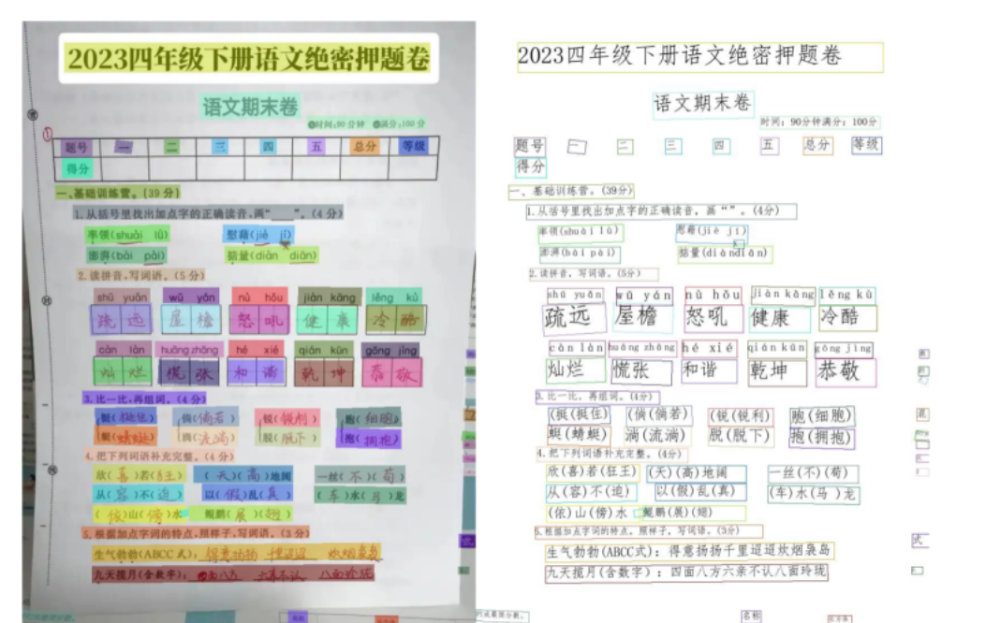
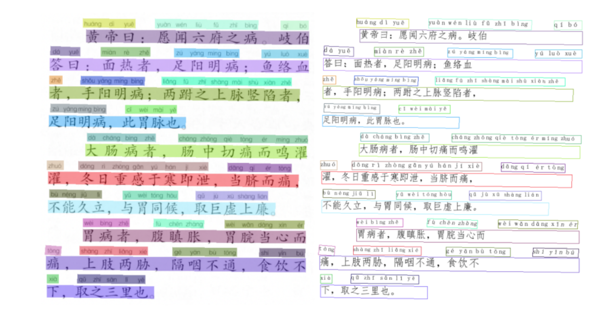
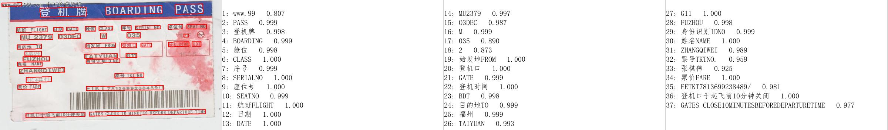
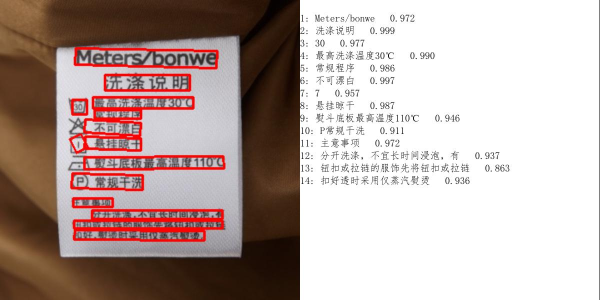
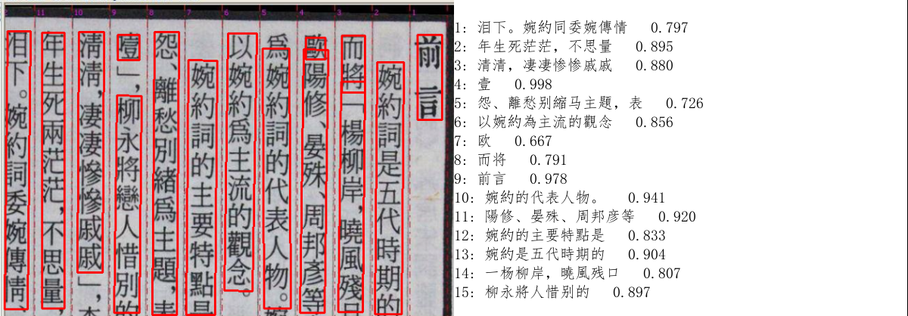
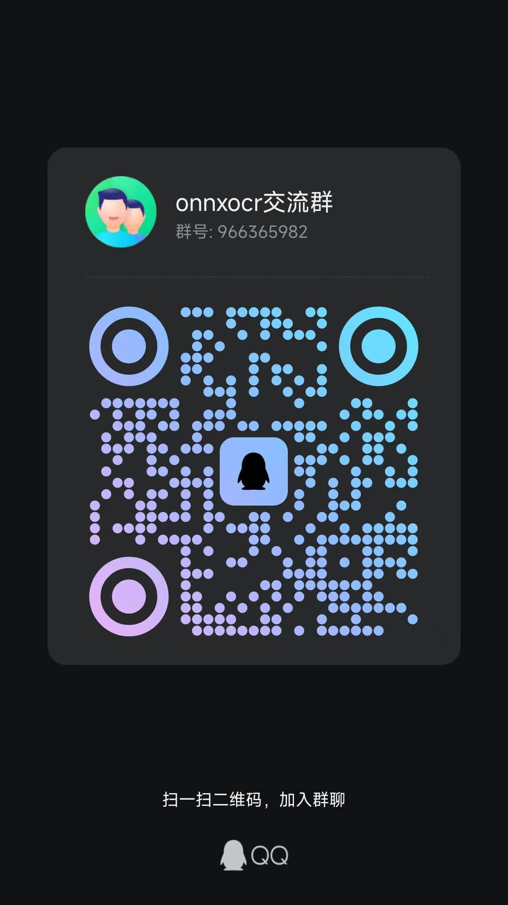

English | [简体中文](./Readme_cn.md) |

### **OnnxOCR**  
###   

**A High-Performance Multilingual OCR Engine Based on ONNX**  

[](https://github.com/jingsongliujing/OnnxOCR/stargazers)  
[](https://github.com/jingsongliujing/OnnxOCR/network/members)  
[](https://github.com/jingsongliujing/OnnxOCR/blob/main/LICENSE)  
[](https://www.python.org/)  


## 🚀 Version Updates  
- **2025.05.21**  
  1. Added PP-OCRv5 model, supporting 5 language types in a single model: Simplified Chinese, Traditional Chinese, Chinese Pinyin, English, and Japanese.  
  2. Overall recognition accuracy improved by 13% compared to PP-OCRv4.  
  3. Accuracy is consistent with PaddleOCR 3.0.  


## 🌟 Core Advantages  
1. **Deep Learning Framework-Free**: A universal OCR engine ready for direct deployment.  
2. **Cross-Architecture Support**: Uses PaddleOCR-converted ONNX models, rebuilt for deployment on both ARM and x86 architecture computers with unchanged accuracy under limited computing power.  
3. **High-Performance Inference**: Faster inference speed on computers with the same performance.  
4. **Multilingual Support**: Single model supports 5 language types: Simplified Chinese, Traditional Chinese, Chinese Pinyin, English, and Japanese.  
5. **Model Accuracy**: Consistent with PaddleOCR models.  
6. **Domestic Hardware Adaptation**: Restructured code architecture for easy adaptation to more domestic GPUs by modifying only the inference engine.  


## 🛠️ Environment Setup  
```bash  
python>=3.6  

pip install -i https://pypi.tuna.tsinghua.edu.cn/simple -r requirements.txt  
```  

**Note**:  
- The Mobile version model is used by default; the PP-OCRv5_Server-ONNX model offers better performance.  
- The Mobile model is already in `onnxocr/models/ppocrv5` and requires no download;  
- The PP-OCRv5_Server-ONNX model is large and uploaded to [Baidu Netdisk](https://pan.baidu.com/s/1hpENH_SkLDdwXkmlsX0GUQ?pwd=wu8t) (extraction code: wu8t). After downloading, place the `det` and `rec` models in `./models/ppocrv5/` to replace the existing ones.  


## 🚀 One-Click Run  
```bash  
python test_ocr.py  
```  


## 📡 API Service (CPU Example)  
### Start Service  
```bash  
python app-service.py  
```  

### Test Example  
#### Request  
```bash  
curl -X POST http://localhost:5005/ocr \  
-H "Content-Type: application/json" \  
-d '{"image": "base64_encoded_image_data"}'  
```  

#### Response  
```json  
{  
  "processing_time": 0.456,  
  "results": [  
    {  
      "text": "Name",  
      "confidence": 0.9999361634254456,  
      "bounding_box": [[4.0, 8.0], [31.0, 8.0], [31.0, 24.0], [4.0, 24.0]]  
    },  
    {  
      "text": "Header",  
      "confidence": 0.9998759031295776,  
      "bounding_box": [[233.0, 7.0], [258.0, 7.0], [258.0, 23.0], [233.0, 23.0]]  
    }  
  ]  
}  
```  


## 🐳 Docker Image Environment (CPU)  
### Build Image  
```bash  
docker build -t ocr-service .  
```  

### Run Image  
```bash  
docker run -itd --name onnxocr-service-v3 -p 5006:5005 onnxocr-service:v3  
```  

### POST Request  
```  
url: ip:5006/ocr  
```  

### Response Example  
```json  
{  
  "processing_time": 0.456,  
  "results": [  
    {  
      "text": "Name",  
      "confidence": 0.9999361634254456,  
      "bounding_box": [[4.0, 8.0], [31.0, 8.0], [31.0, 24.0], [4.0, 24.0]]  
    },  
    {  
      "text": "Header",  
      "confidence": 0.9998759031295776,  
      "bounding_box": [[233.0, 7.0], [258.0, 7.0], [258.0, 23.0], [233.0, 23.0]]  
    }  
  ]  
}  
```  


## 🌟 Effect Demonstration  
| Example 1 | Example 2 |  
|-----------|-----------|  
|  |  |  

| Example 3 | Example 4 |  
|-----------|-----------|  
|  |  |  

| Example 5 | Example 6 |  
|-----------|-----------|  
|  |  |  


## 👨💻 Contact & Communication  
### Career Opportunities  
I am currently seeking job opportunities. Welcome to connect!  
  

### OnnxOCR Community  
#### WeChat Group  
  

#### QQ Group  
  


## 🎉 Acknowledgments  
Thanks to [PaddleOCR](https://github.com/PaddlePaddle/PaddleOCR) for technical support!  


## 🌍 Open Source & Donations  
I am passionate about open source and AI technology, believing they can bring convenience and help to those in need, making the world a better place. If you recognize this project, you can support it via Alipay or WeChat Pay (please note "Support OnnxOCR" in the remarks).  


## 📈 Star History  
[](https://star-history.com/#jingsongliujing/OnnxOCR&Date)  


## 🤝 Contribution Guidelines  
Welcome to submit Issues and Pull Requests to improve the project together!  
