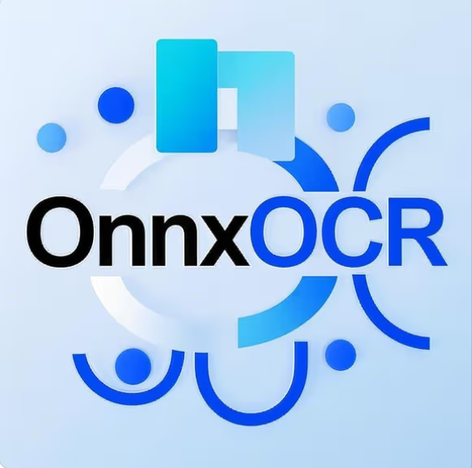
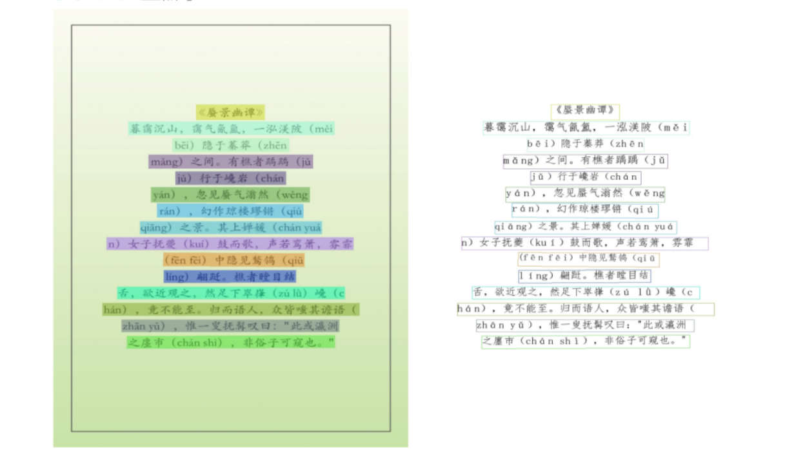
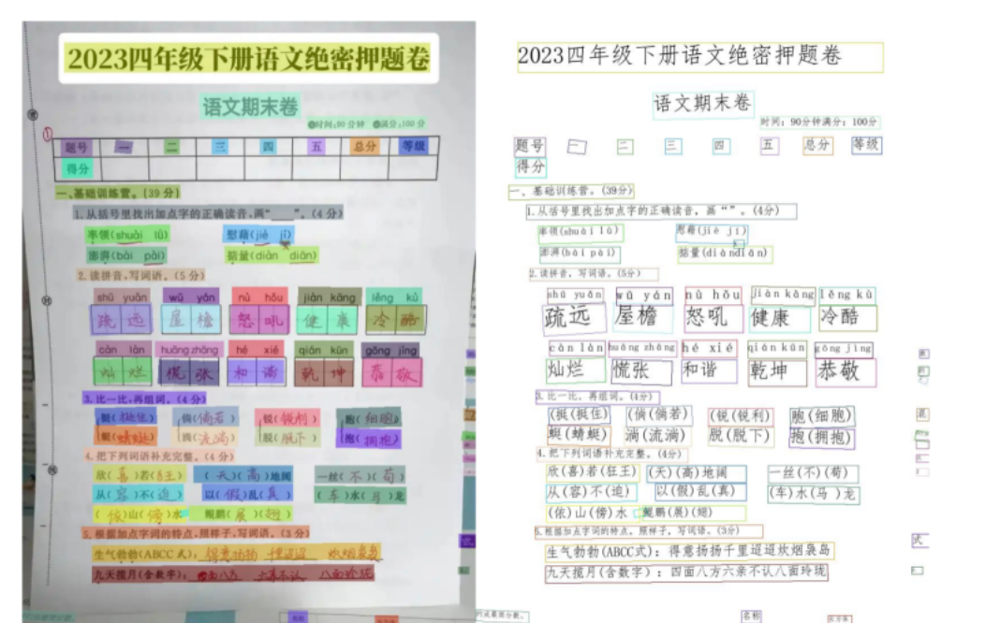
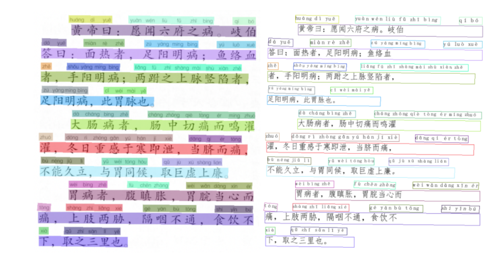
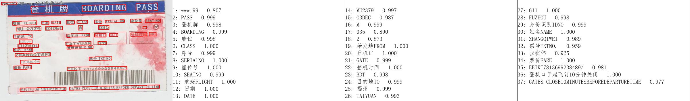
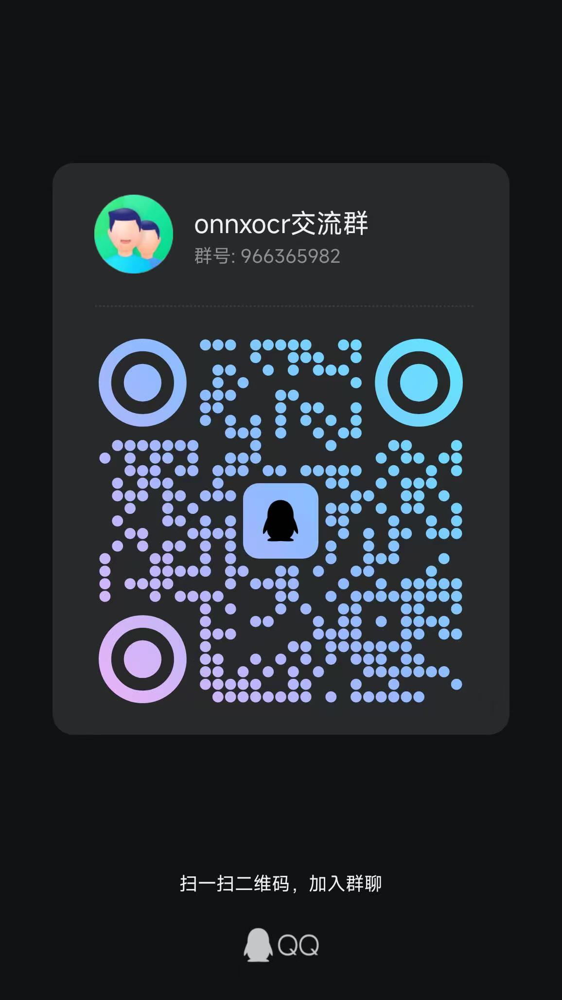

# OnnxOCR

If this project helps you, please consider giving it a **Star**.



**A high-performance multilingual OCR project based on ONNXRuntime**


English | [简体中文](./Readme_cn.md)

## Version Updates

- **2026.05.01**
  1. Added ONNX license plate detection and recognition.
  2. Added RapidTable-based ONNX table recognition.
  3. Added RapidLayout-based Chinese and English layout analysis.
  4. Added RapidDoc-based document layout analysis and Markdown export.
  5. Added `/plate`, `/table`, `/layout`, `/layout_markdown`, and related HTTP endpoints.

- **2025.05.21**
  1. Added PP-OCRv5 models, supporting Simplified Chinese, Traditional Chinese, Chinese Pinyin, English, and Japanese in one model.
  2. Improved overall recognition accuracy compared with PP-OCRv4.
  3. Recognition accuracy is consistent with PaddleOCR 3.0.

## Core Advantages

1. **Deep learning framework free**: a general OCR project ready for deployment.
2. **Cross-architecture support**: PaddleOCR-converted ONNX models can run on ARM and x86 devices.
3. **Unified inference engine**: all ONNX models create ONNXRuntime sessions through `onnxocr/inference_engine.py`.
4. **Multilingual support**: one model supports 5 text types.
5. **Source-level integration**: `rapid_layout`, `rapid_table`, and `rapid_doc` live under the `onnxocr/` package, with no dependency on `rapidocr==3.4.3` or `rapid-orientation`.
6. **Hardware adaptation friendly**: downstream vendors can adapt GPU/NPU providers by modifying the unified inference engine.

## Environment Setup

```bash
python>=3.8
pip install -i https://pypi.tuna.tsinghua.edu.cn/simple -r requirements.txt
```

Notes:

- By default, the repository only includes the PP-OCRv5 general OCR model files required by `tests/test_general_ocr.py`.
- Extra models for license plate recognition, table recognition, layout analysis, orientation classification, and RapidDoc Markdown export are large and should be downloaded on demand. For international users, [HuggingFace](https://huggingface.co/jingsongliu/onnxocr_model/tree/main) is recommended.
- Larger PP-OCRv5 Server ONNX models can also be downloaded separately and used to replace det/rec models under `onnxocr/models/ppocrv5/`.

## Model Download

Extra models are hosted on [HuggingFace: jingsongliu/onnxocr_model](https://huggingface.co/jingsongliu/onnxocr_model/tree/main). International users are recommended to download from HuggingFace:

```bash
python scripts/download_models.py --source huggingface
```

The core HuggingFace API is:

```python
from huggingface_hub import snapshot_download

model_dir = snapshot_download("jingsongliu/onnxocr_model")
```

For users in mainland China, ModelScope remains the default and recommended source:

```bash
python scripts/download_models.py
```

ModelScope repository: [supersong/onnxocr_model](https://www.modelscope.cn/models/supersong/onnxocr_model/tree/master/models).

The script copies the repository `models/` directory into local `onnxocr/models/` and checks required optional files such as `onnxocr/models/rapid_doc/layout/pp_doclayoutv2.onnx`.

To check local models only:

```bash
python scripts/download_models.py --check-only
```

## One-Click Run

```bash
python test_ocr.py
```

`test_ocr.py` runs only general OCR by default. The optional examples are commented out; uncomment them after downloading the corresponding models with `python scripts/download_models.py`.

Feature-specific tests:

```bash
python tests/test_general_ocr.py
python tests/test_license_plate_ocr.py
python tests/test_table_ocr.py
python tests/test_layout_analysis.py
python tests/test_layout_markdown.py
```

Generated files are written to `result_img/`, which is ignored by git.

## General OCR

```python
import cv2
from onnxocr.onnx_paddleocr import ONNXPaddleOcr

img = cv2.imread("onnxocr/test_images/715873facf064583b44ef28295126fa7.jpg")
model = ONNXPaddleOcr(use_angle_cls=False, use_gpu=False)
result = model.ocr(img)
print(result)
```

## License Plate Recognition

License plate recognition is integrated into `ONNXPaddleOcr` as an optional mode. Existing general OCR usage is unchanged.

```python
from onnxocr.onnx_paddleocr import ONNXPaddleOcr, sav2PlateImg

plate_model = ONNXPaddleOcr(
    use_angle_cls=True,
    use_gpu=False,
    use_plate_recognition=True,
    plate_min_score=0.4,
)
plate_result = plate_model.ocr(img)
sav2PlateImg(img, plate_result, name="./result_img/test_plate_vis.jpg")
```

Model files:

```text
onnxocr/models/license_plate/car_plate_detect.onnx
onnxocr/models/license_plate/plate_rec.onnx
```

## Table Recognition

Table recognition is integrated from RapidTable. It reuses general OCR detection/recognition results, restores table structure, and outputs HTML, cell boxes, and logical row/column coordinates.

```python
from onnxocr.onnx_paddleocr import ONNXPaddleOcr, sav2TableImg

table_model = ONNXPaddleOcr(
    use_angle_cls=True,
    use_gpu=False,
    use_table_recognition=True,
    table_model_type="slanet_plus",
)
table_result = table_model.ocr(img)
print(table_result["html"])
sav2TableImg(img, table_result, name="./result_img/test_table_vis.jpg")
```

Model files:

```text
onnxocr/models/table/slanet-plus.onnx
onnxocr/models/table/ch_ppstructure_mobile_v2_SLANet.onnx
onnxocr/models/table/en_ppstructure_mobile_v2_SLANet.onnx
```

## Chinese / English Layout Analysis

Layout analysis is integrated from RapidLayout. It locates document elements such as titles, text blocks, tables, figures, headers, and footers.

```python
from onnxocr.onnx_paddleocr import ONNXPaddleOcr, sav2LayoutImg

layout_model = ONNXPaddleOcr(
    use_gpu=False,
    use_layout_analysis=True,
    layout_model_type="pp_layout_cdla",
)
layout_result = layout_model.ocr(img)
sav2LayoutImg(img, layout_result, name="./result_img/test_layout_vis.jpg")
```

For English layout analysis, set `layout_model_type` to `pp_layout_publaynet`.

Model files:

```text
onnxocr/models/layout/layout_cdla.onnx
onnxocr/models/layout/layout_publaynet.onnx
```

## Document To Markdown

Document-to-Markdown export is integrated from RapidDoc. It analyzes titles, paragraphs, tables, figures, and other layout elements, then saves the result as a Markdown file.

```python
from onnxocr.layout_markdown import LayoutMarkdownConverter

converter = LayoutMarkdownConverter(
    layout_model_type="pp_doclayoutv2",
    formula_enable=False,
    table_enable=True,
)
result = converter.convert_file(
    "onnxocr/test_images/layout_cdla.jpg",
    output_md_path="./result_img/test_layout_markdown.md",
)
print(result["markdown_path"])
```

RapidDoc model files:

```text
onnxocr/models/rapid_doc/layout/pp_doclayoutv2.onnx
onnxocr/models/rapid_doc/table/q_cls.onnx
onnxocr/models/rapid_doc/table/unet.onnx
onnxocr/models/rapid_doc/table/slanet-plus.onnx
```

## Inference Engine Adaptation

General OCR, license plate recognition, table recognition, layout analysis, and RapidDoc document parsing all create ONNXRuntime sessions through `onnxocr/inference_engine.py`.

To adapt a downstream GPU/NPU provider, start from:

```python
from onnxocr.inference_engine import create_session
```

Main extension points:

- `create_session(model_path, providers=None, use_gpu=False, gpu_id=0, sess_options=None)`
- `build_providers(use_gpu=False, gpu_id=0, providers=None)`
- `build_providers_from_engine_cfg(engine_cfg)`
- `ProviderConfig(engine_cfg)`

Only `onnxocr/inference_engine.py` imports `onnxruntime` directly. Feature modules do not call ONNXRuntime APIs directly.

## API Service

Start service:

```bash
python app-service.py
```

Main endpoints:

- `/ocr`: general OCR.
- `/plate`: license plate recognition.
- `/table`: table recognition.
- `/layout`: layout analysis.
- `/layout_markdown`: image/PDF to Markdown.

WebUI:

```bash
python webui.py
```

## Docker Image

```bash
docker build -t ocr-service .
docker run -itd --name onnxocr-service -p 5006:5005 ocr-service
```

## Project Layout

```text
onnxocr/
  inference_engine.py        # single ONNXRuntime entry
  onnx_paddleocr.py          # public user API
  predict_det.py             # general OCR detection
  predict_rec.py             # general OCR recognition
  orientation.py             # local RapidOrientation ONNX adapter
  license_plate.py           # license plate OCR
  table_recognition.py       # table recognition wrapper
  layout_recognition.py      # layout analysis wrapper
  layout_markdown.py         # RapidDoc Markdown wrapper
  rapid_layout/              # source-level RapidLayout ONNX integration
  rapid_table/               # source-level RapidTable ONNX integration
  rapid_doc/                 # source-level RapidDoc ONNX integration
  models/                    # local ONNX models
tests/                       # feature-specific tests
```

## Effect Demonstration

| Example 1 | Example 2 |
|-----------|-----------|
|  |  |

| Example 3 | Example 4 |
|-----------|-----------|
|  |  |

## Contact & Communication

### OnnxOCR Community




## Acknowledgments

Thanks to [PaddleOCR](https://github.com/PaddlePaddle/PaddleOCR) for technical support and model references.

Thanks to the [RapidAI](https://github.com/RapidAI) open-source community, including [RapidTable](https://github.com/RapidAI/RapidTable), [RapidLayout](https://github.com/RapidAI/RapidLayout), [RapidDoc](https://github.com/RapidAI/RapidDoc), and [RapidOrientation](https://github.com/RapidAI/RapidOrientation), for excellent models, code, and engineering references.

## Open Source & Donations

If you recognize this project, you can support it via Alipay or WeChat Pay.


## Star History

[](https://star-history.com/#jingsongliujing/OnnxOCR&Date)

## Contribution Guidelines

Issues and Pull Requests are welcome.
