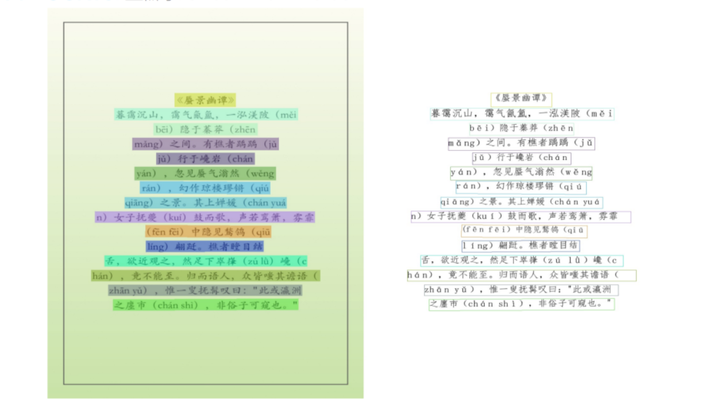
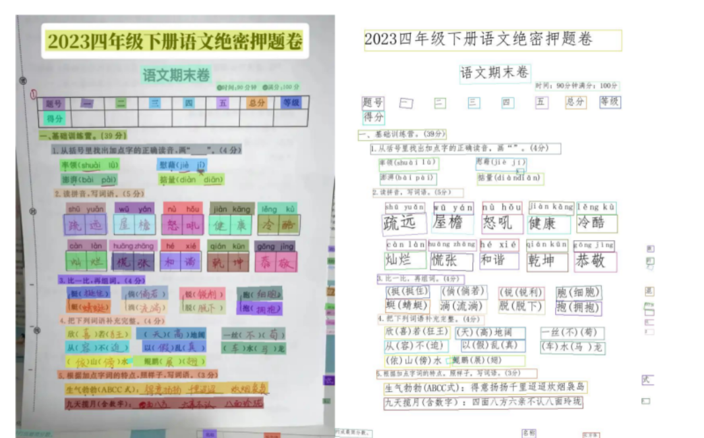
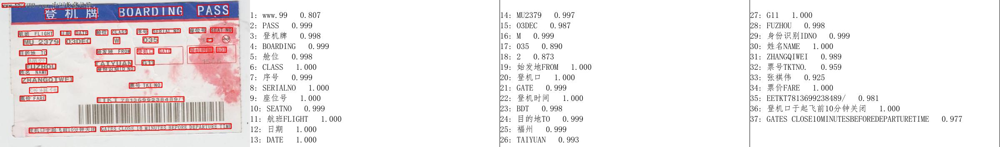
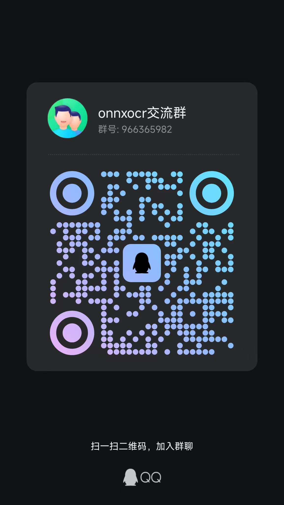

# OnnxOCR

If this project helps you, please consider giving it a **Star**.


**A high-performance multilingual OCR project based on ONNXRuntime**


English | [简体中文](./Readme_cn.md) | [日本語](./Readme_ja.md)

## Version Updates

- **2026.06.11**
  1. Upgraded the default general OCR pipeline to the official PP-OCRv6 Medium ONNX models.
  2. Added official PP-OCRv6 tiny/small/medium detection and recognition ONNX models, plus `ppocrv6_dict.txt` and `ppocrv6_tiny_dict.txt`.
  3. Aligned PP-OCRv6 detection post-processing parameters with the official `inference.yml`.
  4. Added `scripts/benchmark_ppocr_versions.py` for multi-image PP-OCRv5 vs PP-OCRv6 speed comparison.

- **2026.05.27**
  1. Added a new OCR + Qwen3.5-2B ONNX information-extraction workflow.
  2. Added `onnxocr.qwen35_2b` as the package-level Qwen3.5-2B ONNX download, verification, and pure Python inference module.
  3. Added `examples/id_card_extract_with_qwen.py` as an end-to-end example: OnnxOCR full-text recognition first, then Qwen3.5-2B extracts structured ID-card fields.
  4. Qwen3.5-2B ONNX uses a dedicated ModelScope repository: [supersong/qwen2bonnx](https://www.modelscope.cn/models/supersong/qwen2bonnx/tree/master/models).

- **2026.05.01**
  1. Added ONNX license plate detection and recognition.
  2. Added RapidTable-based ONNX table recognition.
  3. Added RapidLayout-based Chinese and English layout analysis.
  4. Added RapidDoc-based document layout analysis and Markdown export.
  5. Added `/plate`, `/table`, `/layout`, `/layout_markdown`, and related HTTP endpoints.

- **2025.05.21**
  1. Added PP-OCRv5 models, supporting Simplified Chinese, Traditional Chinese, Chinese Pinyin, English, and Japanese in one model.
  2. Improved overall recognition accuracy compared with PP-OCRv4.
  3. Recognition accuracy is consistent with PaddleOCR 3.0.

## Core Advantages

1. **Deep learning framework free**: a general OCR project ready for deployment.
2. **Cross-architecture support**: PaddleOCR-converted ONNX models can run on ARM and x86 devices.
3. **Unified inference engine**: all ONNX models create ONNXRuntime sessions through `onnxocr/inference_engine.py`.
4. **Multilingual support**: PP-OCRv6 medium/small support 50 languages in one model, while tiny supports 49 languages.
5. **Source-level integration**: `rapid_layout`, `rapid_table`, and `rapid_doc` live under the `onnxocr/` package, with no dependency on `rapidocr==3.4.3` or `rapid-orientation`.
6. **Hardware adaptation friendly**: downstream vendors can adapt GPU/NPU providers by modifying the unified inference engine.

## Environment Setup

```bash
python>=3.8
pip install -i https://pypi.tuna.tsinghua.edu.cn/simple -r requirements.txt
```

Notes:

- The default general OCR model is the official PP-OCRv6 medium ONNX model.
- Extra models for license plate recognition, table recognition, layout analysis, orientation classification, and RapidDoc Markdown export are large and should be downloaded on demand. For international users, [HuggingFace](https://huggingface.co/jingsongliu/onnxocr_model/tree/main) is recommended.
- PP-OCRv6 tiny/small/medium ONNX models live under `onnxocr/models/ppocrv6/`. Use `ONNXPaddleOcr(ocr_model_size="small")` or `ocr_model_size="tiny"` to switch.

## Model Download

The default download source is the official PaddleX BOS model host and includes PP-OCRv6 tiny/small/medium detection and recognition ONNX models:

```bash
python scripts/download_models.py
```

To download historical extension models from ModelScope:

```bash
python scripts/download_models.py --source modelscope
```

ModelScope repository: [supersong/onnxocr_model](https://www.modelscope.cn/models/supersong/onnxocr_model/tree/master/models).

The script syncs models into local `onnxocr/models/` and checks required PP-OCRv6 and RapidDoc files.

To check local models only:

```bash
python scripts/download_models.py --check-only
```

### Qwen3.5-2B Extraction Backbone

OnnxOCR can also use a local Qwen3.5-2B ONNX model as an information-extraction backbone after OCR. This is useful for workflows such as:

- OCR first: run OnnxOCR to get full-page text and text boxes.
- Extract second: send the OCR text into Qwen3.5-2B ONNX to produce structured JSON.
- Keep data local: both OCR and extraction run with local Python + ONNXRuntime.

Qwen3.5-2B ONNX uses a dedicated model repository, separate from other optional OCR models:

- ModelScope: [supersong/qwen2bonnx](https://www.modelscope.cn/models/supersong/qwen2bonnx/tree/master/models)
- Local path: `onnxocr/models/qwen_2b`

Prepare the Qwen3.5-2B ONNX files:

```bash
python examples/qwen35_2b_onnx.py download --variant q4
python examples/qwen35_2b_onnx.py verify
```

The model is stored under:

```text
onnxocr/models/qwen_2b
```

Pure Python text or image-text smoke test:

```bash
python examples/qwen35_2b_onnx.py run-python --prompt "Hello, introduce yourself briefly."
python examples/qwen35_2b_onnx.py run-python --image onnxocr/models/qwen_2b/images/demo.jpeg --prompt "Describe this image in one short sentence."
```

Use the package API directly:

```python
from onnxocr.qwen35_2b import Qwen35ONNX

qwen = Qwen35ONNX("onnxocr/models/qwen_2b")
text, stopped = qwen.generate("Extract key fields from this OCR text: ...")
print(text)
```

DIY a new extraction scenario:

```python
from onnxocr.qwen35_2b import ExtractionTemplate, QwenScenarioExtractor

invoice_template = ExtractionTemplate(
    name="invoice_basic",
    description="invoice OCR",
    fields=["invoice_number", "seller", "buyer", "amount", "date"],
    rules=[
        "Extract fields only from the OCR text.",
        "Use an empty string when a field is missing or uncertain.",
        "Return JSON only.",
    ],
)

extractor = QwenScenarioExtractor(model_dir="onnxocr/models/qwen_2b")
fields, raw = extractor.extract(ocr_text, template=invoice_template)
print(fields)
```

The base package does not ship vertical-scene prompts. Put scenario-specific templates in your application or under `examples/`, then pass the template into `QwenScenarioExtractor`. You can add templates for invoices, business licenses, contracts, logistics waybills, medical reports, or any other vertical OCR scene by defining fields and rules.

## One-Click Run

```bash
python test_ocr.py
```

`test_ocr.py` runs only general OCR by default. The optional examples are commented out; uncomment them after downloading the corresponding models with `python scripts/download_models.py`.

Feature-specific tests:

```bash
python tests/test_general_ocr.py
python tests/test_license_plate_ocr.py
python tests/test_table_ocr.py
python tests/test_layout_analysis.py
python tests/test_layout_markdown.py
```

Generated files are written to `result_img/`, which is ignored by git.

## PP-OCRv5 / PP-OCRv6 Speed Benchmark

Use the local benchmark script to compare PP-OCRv5 and the default PP-OCRv6 medium model on the same image set. Each image is warmed up once, then timed for the configured number of repeats.

```bash
python scripts/benchmark_ppocr_versions.py --repeats 2
```

Local CPUExecutionProvider results are shown below. Full outputs are written to `output/benchmarks/ppocr_versions_benchmark.md` and `output/benchmarks/ppocr_versions_benchmark.json`. Absolute latency depends on CPU, ONNXRuntime version, thread settings, and image size.

| Model | Total avg (s) | Per image avg (s) | Text lines |
| --- | ---: | ---: | ---: |
| PP-OCRv5 | 7.087 | 0.886 | 250 |
| PP-OCRv6 medium | 27.138 | 3.392 | 242 |

| Image | Size | PP-OCRv5 avg (s) | PP-OCRv6 medium avg (s) | v6/v5 | v5 lines | v6 lines |
| --- | --- | ---: | ---: | ---: | ---: | ---: |
| 715873facf064583b44ef28295126fa7.jpg | 1920x2560 | 2.251 | 8.725 | 3.88x | 72 | 64 |
| 12.jpg | 720x1150 | 0.370 | 1.341 | 3.63x | 4 | 4 |
| 1.jpg | 720x1150 | 0.317 | 1.134 | 3.58x | 2 | 2 |
| french_0.jpg | 692x1024 | 0.474 | 1.396 | 2.94x | 6 | 6 |
| japan_2.jpg | 1536x839 | 1.138 | 5.096 | 4.48x | 50 | 54 |
| weixin_pay.jpg | 1263x1719 | 0.372 | 2.359 | 6.35x | 3 | 3 |
| table.jpg | 371x293 | 1.151 | 4.125 | 3.58x | 81 | 75 |
| 00006737.jpg | 896x528 | 1.015 | 2.963 | 2.92x | 32 | 34 |

Note: PP-OCRv6 medium is larger and is slower than PP-OCRv5 under CPU ONNXRuntime in this local test. Its benefit is broader language coverage and stronger overall accuracy in official benchmarks. For latency-sensitive CPU scenarios, try `ONNXPaddleOcr(ocr_model_size="small")` or `ocr_model_size="tiny"`.

## General OCR

```python
import cv2
from onnxocr.onnx_paddleocr import ONNXPaddleOcr

img = cv2.imread("onnxocr/test_images/715873facf064583b44ef28295126fa7.jpg")
model = ONNXPaddleOcr(use_angle_cls=False, use_gpu=False)
result = model.ocr(img)
print(result)
```

## OCR + Qwen Information Extraction

`examples/id_card_extract_with_qwen.py` is a minimal end-to-end vertical-scene example. The reusable Qwen inference and generic template extraction code lives in `onnxocr.qwen35_2b`; the ID-card fields and prompt rules live only in this example.

Default example:

```bash
python examples/id_card_extract_with_qwen.py
```

Specify an image explicitly:

```bash
python examples/id_card_extract_with_qwen.py --image "onnxocr/test_images/8f113149-ff64-4c9f-8dc0-e34100365aa4.jpg"
```

Output:

```text
result_img/id_card_front_qwen_extract.json
```

The script does not print sensitive ID-card fields by default. Use `--show-sensitive` only in a trusted local environment.

## License Plate Recognition

License plate recognition is integrated into `ONNXPaddleOcr` as an optional mode. Existing general OCR usage is unchanged.

```python
from onnxocr.onnx_paddleocr import ONNXPaddleOcr, sav2PlateImg

plate_model = ONNXPaddleOcr(
    use_angle_cls=True,
    use_gpu=False,
    use_plate_recognition=True,
    plate_min_score=0.4,
)
plate_result = plate_model.ocr(img)
sav2PlateImg(img, plate_result, name="./result_img/test_plate_vis.jpg")
```

Model files:

```text
onnxocr/models/license_plate/car_plate_detect.onnx
onnxocr/models/license_plate/plate_rec.onnx
```

## Table Recognition

Table recognition is integrated from RapidTable. It reuses general OCR detection/recognition results, restores table structure, and outputs HTML, cell boxes, and logical row/column coordinates.

```python
from onnxocr.onnx_paddleocr import ONNXPaddleOcr, sav2TableImg

table_model = ONNXPaddleOcr(
    use_angle_cls=True,
    use_gpu=False,
    use_table_recognition=True,
    table_model_type="slanet_plus",
)
table_result = table_model.ocr(img)
print(table_result["html"])
sav2TableImg(img, table_result, name="./result_img/test_table_vis.jpg")
```

Model files:

```text
onnxocr/models/table/slanet-plus.onnx
onnxocr/models/table/ch_ppstructure_mobile_v2_SLANet.onnx
onnxocr/models/table/en_ppstructure_mobile_v2_SLANet.onnx
```

## Chinese / English Layout Analysis

Layout analysis is integrated from RapidLayout. It locates document elements such as titles, text blocks, tables, figures, headers, and footers.

```python
from onnxocr.onnx_paddleocr import ONNXPaddleOcr, sav2LayoutImg

layout_model = ONNXPaddleOcr(
    use_gpu=False,
    use_layout_analysis=True,
    layout_model_type="pp_layout_cdla",
)
layout_result = layout_model.ocr(img)
sav2LayoutImg(img, layout_result, name="./result_img/test_layout_vis.jpg")
```

For English layout analysis, set `layout_model_type` to `pp_layout_publaynet`.

Model files:

```text
onnxocr/models/layout/layout_cdla.onnx
onnxocr/models/layout/layout_publaynet.onnx
```

## Document To Markdown

Document-to-Markdown export is integrated from RapidDoc. It analyzes titles, paragraphs, tables, figures, and other layout elements, then saves the result as a Markdown file.

```python
from onnxocr.layout_markdown import LayoutMarkdownConverter

converter = LayoutMarkdownConverter(
    layout_model_type="pp_doclayoutv2",
    formula_enable=False,
    table_enable=True,
)
result = converter.convert_file(
    "onnxocr/test_images/layout_cdla.jpg",
    output_md_path="./result_img/test_layout_markdown.md",
)
print(result["markdown_path"])
```

RapidDoc model files:

```text
onnxocr/models/rapid_doc/layout/pp_doclayoutv2.onnx
onnxocr/models/rapid_doc/table/q_cls.onnx
onnxocr/models/rapid_doc/table/unet.onnx
onnxocr/models/rapid_doc/table/slanet-plus.onnx
```

## Inference Engine Adaptation

General OCR, license plate recognition, table recognition, layout analysis, and RapidDoc document parsing all create ONNXRuntime sessions through `onnxocr/inference_engine.py`.

To adapt a downstream GPU/NPU provider, start from:

```python
from onnxocr.inference_engine import create_session
```

Main extension points:

- `create_session(model_path, providers=None, use_gpu=False, gpu_id=0, sess_options=None)`
- `build_providers(use_gpu=False, gpu_id=0, providers=None)`
- `build_providers_from_engine_cfg(engine_cfg)`
- `ProviderConfig(engine_cfg)`

Only `onnxocr/inference_engine.py` imports `onnxruntime` directly. Feature modules do not call ONNXRuntime APIs directly.

## API Service

`app-service.py` is the deployable JSON API service. `webui.py` is the browser UI service. Keeping them separate makes the repository easier to deploy, test, and extend.

Start API service:

```bash
python app-service.py
```

Environment variables:

- `ONNXOCR_PORT`: service port, default `5005`.
- `ONNXOCR_USE_GPU`: set to `1` / `true` to enable GPU providers.
- `ONNXOCR_DEBUG`: set to `1` / `true` to enable Flask debug mode.
- `ONNXOCR_OUTPUT_DIR`: output directory for generated Markdown/assets, default `result_img`.
- `ONNXOCR_MAX_UPLOAD_MB`: max upload size in MB, default `200`.

Main endpoints accept JSON base64 images or multipart file uploads:

- `/health`: service health check.
- `/ocr`: general OCR.
- `/plate`: license plate recognition.
- `/table`: table recognition.
- `/layout`: layout analysis.
- `/layout_markdown`: image/PDF to Markdown.

JSON example:

```bash
curl -X POST http://127.0.0.1:5005/ocr \
  -H "Content-Type: application/json" \
  -d "{\"image\":\"<base64-image>\"}"
```

Multipart example:

```bash
curl -X POST http://127.0.0.1:5005/ocr \
  -F "image=@onnxocr/test_images/715873facf064583b44ef28295126fa7.jpg"
```

Start WebUI:

```bash
python webui.py
```

## Docker Image

```bash
docker build -t ocr-service .
docker run -itd --name onnxocr-service -p 5006:5005 ocr-service
```

The Docker image excludes generated outputs and optional large model artifacts through `.dockerignore`. Mount or download optional models when you need plate, table, layout, or RapidDoc features.

## Project Layout

```text
app-service.py                 # deployable JSON API service
webui.py                       # browser UI service
test_ocr.py                    # one-click local OCR demo
requirements.txt               # runtime dependencies
Dockerfile                     # container image for API deployment
.dockerignore                  # keeps caches/outputs/large models out of Docker context
Readme.md                      # English documentation
Readme_cn.md                   # Simplified Chinese documentation
Readme_ja.md                   # Japanese documentation
onnxocr/
  inference_engine.py        # single ONNXRuntime entry
  onnx_paddleocr.py          # public user API
  predict_det.py             # general OCR detection
  predict_rec.py             # general OCR recognition
  orientation.py             # local RapidOrientation ONNX adapter
  license_plate.py           # license plate OCR
  table_recognition.py       # table recognition wrapper
  layout_recognition.py      # layout analysis wrapper
  layout_markdown.py         # RapidDoc Markdown wrapper
  rapid_layout/              # source-level RapidLayout ONNX integration
  rapid_table/               # source-level RapidTable ONNX integration
  rapid_doc/                 # source-level RapidDoc ONNX integration
  models/                    # local ONNX models
scripts/
  download_models.py         # optional model download/check helper
tests/                       # feature-specific tests and API smoke tests
```

## Effect Demonstration

| Example 1 | Example 2 |
|-----------|-----------|
|  |  |

| Example 3 | Example 4 |
|-----------|-----------|
|  |  |

## Contact & Communication

### OnnxOCR Community




## Acknowledgments

Thanks to [PaddleOCR](https://github.com/PaddlePaddle/PaddleOCR) for technical support and model references.

Thanks to the [RapidAI](https://github.com/RapidAI) open-source community, including [RapidTable](https://github.com/RapidAI/RapidTable), [RapidLayout](https://github.com/RapidAI/RapidLayout), [RapidDoc](https://github.com/RapidAI/RapidDoc), and [RapidOrientation](https://github.com/RapidAI/RapidOrientation), for excellent models, code, and engineering references.

## Open Source & Donations

If you recognize this project, you can support it via Alipay or WeChat Pay.


## Star History

[](https://star-history.com/#jingsongliujing/OnnxOCR&Date)

## Contribution Guidelines

Issues and Pull Requests are welcome. To keep the project usable for open-source users, please follow these rules:

1. Keep API-only behavior in `app-service.py` and browser/UI behavior in `webui.py`.
2. Do not commit generated files from `result_img/`, `results/`, `uploads/`, or local cache directories.
3. Do not commit private documents, ID cards, bank cards, medical records, contracts, waybills, or production secrets.
4. Use public samples, official examples, or authorized anonymized samples for tests and documentation.
5. If a feature requires optional model files, document the exact model files and download command.
6. Keep README examples runnable against the current repository. Do not document commands that are not implemented.

Recommended checks before opening a pull request:

```bash
python -B -m pytest tests/test_app_service.py -p no:cacheprovider
python tests/test_general_ocr.py
python tests/test_license_plate_ocr.py
python tests/test_table_ocr.py
python tests/test_layout_analysis.py
python tests/test_layout_markdown.py
```

Some tests require optional model files. If you cannot run them locally, mention the missing model files in your pull request.
