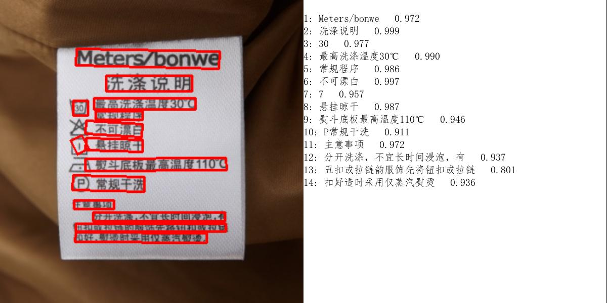

# 如果项目对您有帮助，麻烦右上角点个Star呗
# onnxOCR

#### 版本更新
PPOCRv4模型转onnx模型推理，精度和性能更高，推理速度比使用paddlepaddle框架快5倍

####   一.优势：
1.脱离深度学习训练框架，可直接用于部署的通用OCR。
2.在算力有限，精度不变的情况下使用paddleOCR转成ONNX模型，进行重新构建的一款可部署在arm架构和x86架构计算机上的OCR模型。
3.在同样性能的计算机上推理速度加速了4-5倍。

#### 二.环境安装
    python>=3.6

    pip install -i https://pypi.tuna.tsinghua.edu.cn/simple -r requirements.txt

    此版本模型已经存在于onnxocr\models\ppocrv4下，无需下载，假如需要跑ppocrv2版本，需要下载rec模型超过了100M，github有限制，所以我上传到
[百度网盘,提取码: 125c](https://pan.baidu.com/s/1O1b30CMwsDjD7Ti9EnxYKQ )
     
    下载后放到./models/ch_ppocr_server_v2.0/rec/rec.onnx下

#### 三.一键运行

    python test_ocr.py

#### 效果展示

##
##
##
### 最近在求一份工作，或者您有什么建议可以加我的微信

#### OnnxOCR交流群
##### 微信群

##### QQ群

#### 感谢PaddleOcr

https://github.com/PaddlePaddle/PaddleOCR

## Star History

