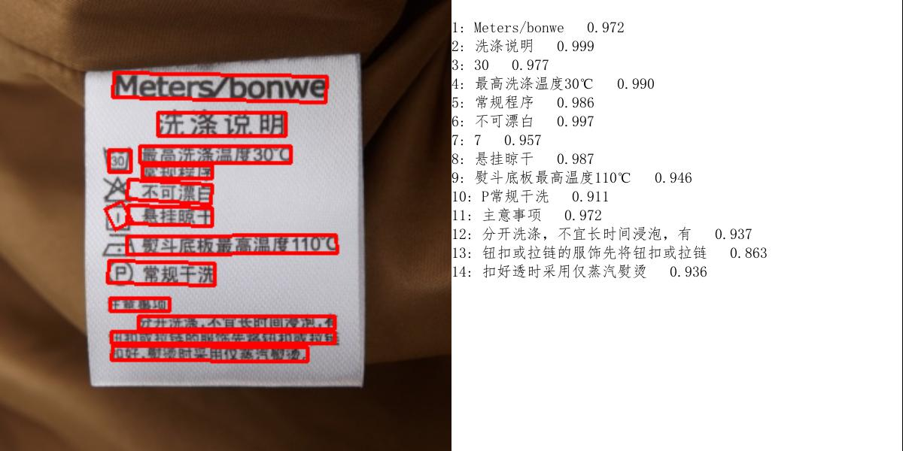
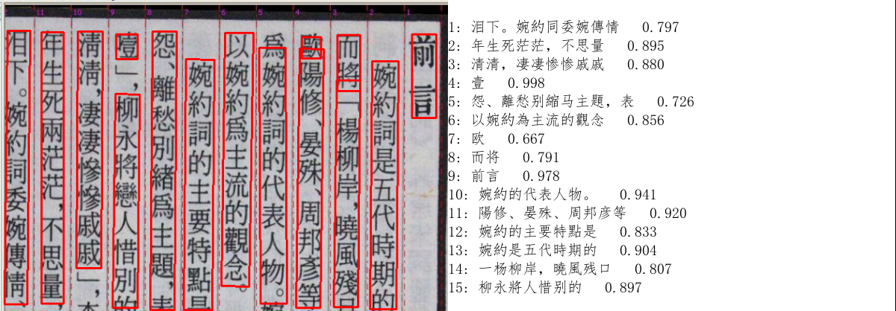

如果项目对您有帮助，欢迎点击右上角 **Star** 支持！✨  
### **OnnxOCR**  
###   

**基于 ONNX 的高性能多语言 OCR 引擎**  
  
  
  
  


## 🚀 版本更新  
- **2026.05.01**
  1. 新增 ONNX 车牌检测与车牌号识别能力。
  2. 新增基于 RapidTable 的 ONNX 表格识别能力。
  3. `ONNXPaddleOcr` 新增 `use_plate_recognition` 和 `use_table_recognition` 参数，默认值均为 `False`，原有通用 OCR 调用方式不受影响。
  4. 新增 `/plate`、`/plate_api`、`/table` 和 `/table_api` HTTP 接口。

- **2025.05.21**  
  1. 新增 PP-OCRv5 模型，单模型支持 5 种文字类型：简体中文、繁体中文、中文拼音、英文和日文。  
  2. 整体识别精度相比ppocrv4提升13个百分点
  3. 精度与Paddleocr3.0保持一致。


## 🌟 核心优势  
1. **脱离深度学习训练框架**：可直接用于部署的通用 OCR。  
2. **跨架构支持**：在算力有限、精度不变的情况下，使用 PaddleOCR 转成 ONNX 模型，重新构建的可部署在 ARM 架构和 x86 架构计算机上的 OCR 模型。  
3. **高性能推理**：在同样性能的计算机上推理速度加速。  
4. **多语言支持**：单模型支持 5 种文字类型：简体中文、繁体中文、中文拼音、英文和日文。  
5. **模型精度**：与 PaddleOCR 模型保持一致。
6. **国产化适配**：重构代码工程架构，只需简单进行推理引擎的修改，即可适配更多国产化显卡。


## 🛠️ 环境安装  
```bash  
python>=3.6  

pip install -i https://pypi.tuna.tsinghua.edu.cn/simple -r requirements.txt  
```  

**注意**：  
- 默认使用 Mobile 版本模型，使用 PP-OCRv5_Server-ONNX 模型效果更佳。  
- Mobile 模型已存在于 `onnxocr/models/ppocrv5` 下，无需下载；  
- PP-OCRv5_Server-ONNX 模型过大，已上传至 [百度网盘](https://pan.baidu.com/s/1hpENH_SkLDdwXkmlsX0GUQ?pwd=wu8t)（提取码: wu8t），下载后将 `det` 和 `rec` 模型放到 `./models/ppocrv5/` 下替换即可。  


## 🚀 一键运行  
```bash  
python test_ocr.py  
```  

`test_ocr.py` 已包含通用 OCR 和车牌识别两种示例。


## 🚗 车牌识别
车牌识别已作为可选模式融合到 `ONNXPaddleOcr` 中。默认仍然使用原来的通用 OCR 流程，因此已有代码无需修改：

```python
from onnxocr.onnx_paddleocr import ONNXPaddleOcr

general_model = ONNXPaddleOcr(use_angle_cls=True, use_gpu=False)
general_result = general_model.ocr(img)
```

需要车牌识别时，增加 `use_plate_recognition=True`：

```python
from onnxocr.onnx_paddleocr import ONNXPaddleOcr

plate_model = ONNXPaddleOcr(
    use_angle_cls=True,
    use_gpu=False,
    use_plate_recognition=True,
    plate_min_score=0.4,
)
plate_result = plate_model.ocr(img)
```

### 参数说明
| 参数 | 默认值 | 说明 |
|------|--------|------|
| `use_plate_recognition` | `False` | 设置为 `True` 时启用车牌检测与识别。 |
| `plate_min_score` | `0.4` | 车牌检测最小置信度阈值。 |
| `plate_iou_thresh` | `0.5` | 车牌检测 NMS 的 IoU 阈值。 |
| `plate_detect_model_path` | 内置模型路径 | 可选，自定义车牌检测 ONNX 模型路径。 |
| `plate_rec_model_path` | 内置模型路径 | 可选，自定义车牌识别 ONNX 模型路径。 |
| `plate_providers` | `["CPUExecutionProvider"]` | 可选，车牌模型使用的 ONNX Runtime providers。 |

### 模型文件位置
```text
onnxocr/models/license_plate/car_plate_detect.onnx
onnxocr/models/license_plate/plate_rec.onnx
```

### 返回格式
```json
[
  {
    "cls": "plate",
    "axis": [239, 508, 298, 574],
    "score": 0.9027,
    "plate": "浙B2V9L7",
    "type": "single_layer",
    "landmarks": [[240.73, 509.77], [298.16, 536.68], [297.6, 573.88], [240.76, 546.85]]
  }
]
```


## 🔧 推理引擎适配
项目中的通用 OCR、车牌识别、表格识别都通过 `onnxocr/inference_engine.py` 创建 ONNXRuntime session。后续如果要适配下游厂商 GPU/NPU，国产化显卡（寒武纪、海光、华为昇腾）一般只需要在这个文件中调整 `build_providers()` 或 `create_session()`，业务推理模块不需要分别修改。


## 📊 表格识别
表格识别把 RapidTable 融合到 OnnxOCR 中，会复用当前通用 OCR 的文字检测和识别结果，再进行表格结构还原，最终输出 HTML、单元格框和逻辑行列坐标。

```python
from onnxocr.onnx_paddleocr import ONNXPaddleOcr

table_model = ONNXPaddleOcr(
    use_angle_cls=True,
    use_gpu=False,
    use_table_recognition=True,
    table_model_type="slanet_plus",
)
table_result = table_model.ocr(img)
print(table_result["html"])
```

### 参数说明
| 参数 | 默认值 | 说明 |
|------|--------|------|
| `use_table_recognition` | `False` | 设置为 `True` 时启用表格结构识别。 |
| `table_model_type` | `slanet_plus` | 表格模型类型，支持 `slanet_plus`、`ppstructure_zh`、`ppstructure_en`。 |
| `table_model_path` | 内置模型路径 | 可选，自定义表格 ONNX 模型路径。 |
| `table_engine_cfg` | `{}` | 可选，RapidTable 的 ONNXRuntime 推理配置。 |

### 模型文件位置
```text
onnxocr/models/table/slanet-plus.onnx
onnxocr/models/table/ch_ppstructure_mobile_v2_SLANet.onnx
onnxocr/models/table/en_ppstructure_mobile_v2_SLANet.onnx
```

### 返回格式
```json
{
  "html": "<html><body><table>...</table></body></html>",
  "cell_bboxes": [[10.0, 20.0, 80.0, 40.0]],
  "logic_points": [[0, 0, 0, 0]],
  "processing_time": 0.28,
  "model_type": "slanet_plus"
}
```


## 📡 API 服务（CPU 示例）  
### 启动服务  
```bash  
python app-service.py  
```  

### 测试示例  
#### 请求  
```bash  
curl -X POST http://localhost:5005/ocr \  
-H "Content-Type: application/json" \  
-d '{"image": "base64_encoded_image_data"}'  
```  

#### 响应  
```json  
{  
  "processing_time": 0.456,  
  "results": [  
    {  
      "text": "名称",  
      "confidence": 0.9999361634254456,  
      "bounding_box": [[4.0, 8.0], [31.0, 8.0], [31.0, 24.0], [4.0, 24.0]]  
    },  
    {  
      "text": "标头",  
      "confidence": 0.9998759031295776,  
      "bounding_box": [[233.0, 7.0], [258.0, 7.0], [258.0, 23.0], [233.0, 23.0]]  
    }  
  ]  
}  
```  

### 车牌识别 API
`app-service.py` 提供 `/plate` 接口，`webui.py` 提供 `/plate_api` 接口。两个接口都使用和通用 OCR 一致的 base64 JSON 图片输入格式。

#### 请求
```bash
curl -X POST http://localhost:5005/plate \
-H "Content-Type: application/json" \
-d '{"image": "base64_encoded_image_data", "min_score": 0.4}'
```

#### 响应
```json
{
  "processing_time": 0.158,
  "results": [
    {
      "cls": "plate",
      "axis": [239, 508, 298, 574],
      "score": 0.9027,
      "plate": "浙B2V9L7",
      "type": "single_layer",
      "landmarks": [[240.73, 509.77], [298.16, 536.68], [297.6, 573.88], [240.76, 546.85]]
    }
  ]
}
```

### 表格识别 API
`app-service.py` 提供 `/table` 接口，`webui.py` 提供 `/table_api` 接口。

#### 请求
```bash
curl -X POST http://localhost:5005/table \
-H "Content-Type: application/json" \
-d '{"image": "base64_encoded_image_data"}'
```

#### 响应
```json
{
  "html": "<html><body><table>...</table></body></html>",
  "cell_bboxes": [[10.0, 20.0, 80.0, 40.0]],
  "logic_points": [[0, 0, 0, 0]],
  "processing_time": 0.28,
  "model_type": "slanet_plus"
}
```


## 🐳 Docker 镜像环境（CPU）  
### 镜像构建  
```bash  
docker build -t ocr-service .  
```  

### 镜像启动  
```bash  
docker run -itd --name onnxocr-service-v3 -p 5006:5005 onnxocr-service:v3  
```  

### POST 请求  
```  
url: ip:5006/ocr  
```  

### 返回值示例  
```json  
{  
  "processing_time": 0.456,  
  "results": [  
    {  
      "text": "名称",  
      "confidence": 0.9999361634254456,  
      "bounding_box": [[4.0, 8.0], [31.0, 8.0], [31.0, 24.0], [4.0, 24.0]]  
    },  
    {  
      "text": "标头",  
      "confidence": 0.9998759031295776,  
      "bounding_box": [[233.0, 7.0], [258.0, 7.0], [258.0, 23.0], [233.0, 23.0]]  
    }  
  ]  
}  
```  


## 🌟 效果展示  
| 示例 1 | 示例 2 |  
|--------|--------|  
|  |  |  

| 示例 3 | 示例 4 |  
|--------|--------|  
|  |  |  

| 示例 5 | 示例 6 |  
|--------|--------|  
|  |  |  


## 👨💻 联系与交流  
### 求职信息  
本人正在寻求工作机会，欢迎联系！  
  

### OnnxOCR 交流群  
#### 微信群  
  

#### QQ 群  
  


## 🎉 致谢  
非常感谢 [PaddleOCR](https://github.com/PaddlePaddle/PaddleOCR) 提供的技术支持！  
非常感谢 [RapidTable](https://github.com/RapidAI/RapidTable) 提供的表格识别模型和代码参考！


## 🌍 开源与捐赠  
我热爱开源和 AI 技术，相信它们能为有需要的人带来便利和帮助，让世界变得更美好。如果您认可本项目，可以通过支付宝或微信进行打赏（备注请注明支持 OnnxOCR）。  


## 📈 Star 历史  
[](https://star-history.com/#jingsongliujing/OnnxOCR&Date)  


## 🤝 贡献指南  
欢迎提交 Issues 和 Pull Requests，共同改进项目！  
