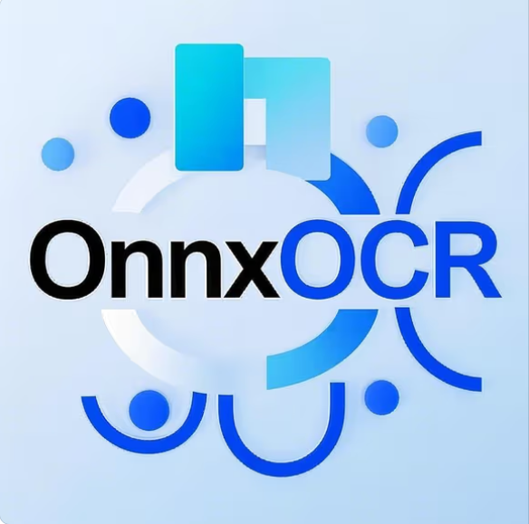
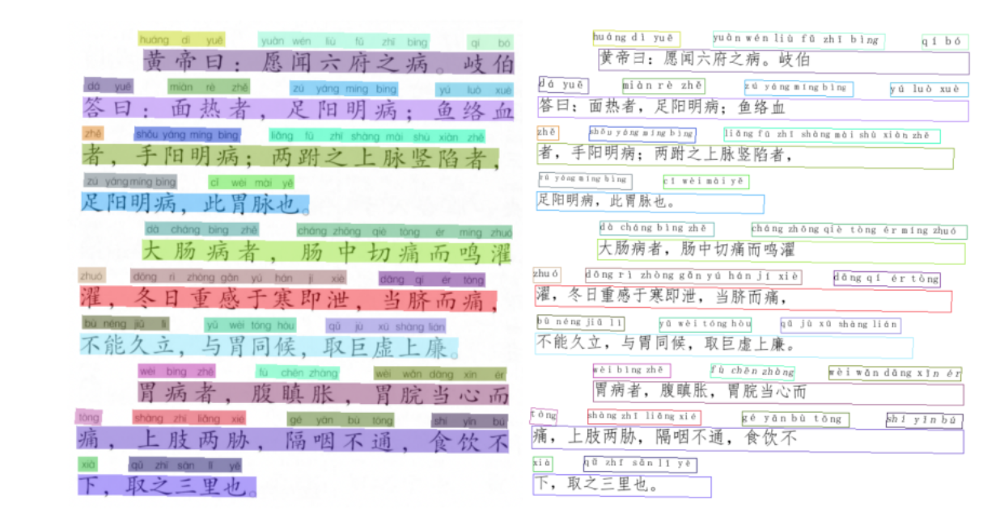

# OnnxOCR

**基于 ONNXRuntime 的高性能多语种 OCR 工程**




[English](./Readme.md) | 简体中文

---

## 项目简介

OnnxOCR 是一个**开箱即用、无需深度学习框架**的 OCR 工程化项目。基于 PaddleOCR 转换的 ONNX 模型，支持在 ARM/x86 设备上部署，适用于文档数字化、票据识别、证照识别等场景。

**核心价值：** 将 PaddleOCR 的优秀模型转换为 ONNX 格式，保留完整识别能力的同时，大幅降低部署门槛。

---

## 功能概览

| 功能 | 说明 | 是否需要额外模型 |
|------|------|------------------|
| **通用 OCR** | 中文、英文、日文等多语种文字检测与识别 | ❌ 内置 |
| **车牌识别** | 中国车牌检测与识别 | ✅ 下载 |
| **表格识别** | 表格结构化，输出 HTML/坐标 | ✅ 下载 |
| **版面分析** | 文档元素定位（标题/正文/表格/图片） | ✅ 下载 |
| **文档转 Markdown** | 文档/图片/PDF 转 Markdown | ✅ 下载 |
| **垂直行业 CLI** | 火车票、试卷、身份证、银行卡等结构化提取 | ❌ 内置 |

---

## 快速开始

### 1. 安装环境

```bash
# 克隆项目
git clone https://github.com/jingsongliujing/OnnxOCR.git
cd OnnxOCR

# 安装依赖（国内镜像加速）
pip install -i https://pypi.tuna.tsinghua.edu.cn/simple -r requirements.txt
```

### 2. 运行第一个 OCR 示例

```python
import cv2
from onnxocr.onnx_paddleocr import ONNXPaddleOcr

# 初始化模型
model = ONNXPaddleOcr(use_angle_cls=False, use_gpu=False)

# 读取图片并识别
img = cv2.imread("onnxocr/test_images/715873facf064583b44ef28295126fa7.jpg")
result = model.ocr(img)
print(result)
```

或者直接运行测试：

```bash
python test_ocr.py
```

### 3. 使用垂直行业 CLI（可选）

```bash
# 安装 CLI
pip install -e .

# 查看支持的场景
onnocr list

# 识别火车票
onnocr run transport.train_ticket <图片路径> --pretty
```

---

## 功能详解

### 通用 OCR

支持中英文、日文等多语种的文字检测与识别，单模型支持 5 种文字类型。

```python
import cv2
from onnxocr.onnx_paddleocr import ONNXPaddleOcr

img = cv2.imread("test.jpg")
model = ONNXPaddleOcr(use_angle_cls=False, use_gpu=False)
result = model.ocr(img)
```

### 车牌识别

集成车牌检测与识别功能，支持蓝牌、绿牌、黄牌等中国车牌类型。

```python
from onnxocr.onnx_paddleocr import ONNXPaddleOcr, sav2PlateImg

plate_model = ONNXPaddleOcr(
    use_angle_cls=True,
    use_gpu=False,
    use_plate_recognition=True,
    plate_min_score=0.4,
)
plate_result = plate_model.ocr(img)
sav2PlateImg(img, plate_result, name="./output/plate_vis.jpg")
```

**模型文件：**
```
onnxocr/models/license_plate/car_plate_detect.onnx
onnxocr/models/license_plate/plate_rec.onnx
```

### 表格识别

基于 RapidTable，将表格图片转换为结构化 HTML 和单元格坐标。

```python
from onnxocr.onnx_paddleocr import ONNXPaddleOcr, sav2TableImg

table_model = ONNXPaddleOcr(
    use_angle_cls=True,
    use_gpu=False,
    use_table_recognition=True,
    table_model_type="slanet_plus",
)
table_result = table_model.ocr(img)
print(table_result["html"])
sav2TableImg(img, table_result, name="./output/table_vis.jpg")
```

**模型文件：**
```
onnxocr/models/table/slanet-plus.onnx
onnxocr/models/table/ch_ppstructure_mobile_v2_SLANet.onnx
```

### 版面分析

基于 RapidLayout，定位文档中的标题、正文、表格、图片等元素。

```python
from onnxocr.onnx_paddleocr import ONNXPaddleOcr, sav2LayoutImg

layout_model = ONNXPaddleOcr(
    use_gpu=False,
    use_layout_analysis=True,
    layout_model_type="pp_layout_cdla",
)
layout_result = layout_model.ocr(img)
sav2LayoutImg(img, layout_result, name="./output/layout_vis.jpg")
```

**模型文件：**
```
onnxocr/models/layout/layout_cdla.onnx
onnxocr/models/layout/layout_publaynet.onnx
```

### 文档转 Markdown

基于 RapidDoc，将文档图片/PDF 转换为结构化 Markdown 文件。

```python
from onnxocr.layout_markdown import LayoutMarkdownConverter

converter = LayoutMarkdownConverter(
    layout_model_type="pp_doclayoutv2",
    formula_enable=False,
    table_enable=True,
)
result = converter.convert_file(
    "onnxocr/test_images/layout_cdla.jpg",
    output_md_path="./output/test_markdown.md",
)
print(result["markdown_path"])
```

**模型文件：**
```
onnxocr/models/rapid_doc/layout/pp_doclayoutv2.onnx
onnxocr/models/rapid_doc/table/slanet-plus.onnx
```

---

## 垂直行业 CLI

OnnxOCR 提供面向 Agent 的垂直行业 CLI，支持结构化字段提取。

### 支持的场景

**默认场景（已验证）：**

| 场景 | Skill ID | 提取字段 |
|------|----------|----------|
| 试卷 | `education.exam_paper` | 标题、年级、科目、考试时间、满分 |
| 身份证 | `identity.id_card` | 姓名、性别、民族、出生日期、住址、身份证号 |
| 银行卡 | `finance.bank_card` | 卡号、银行名称、有效期、卡类型 |
| 发票 | `finance.invoice` | 发票代码、发票号码、开票日期、购买方、销售方、金额 |
| 车牌 | `vehicle.plate` | 车牌号码 |
| 表格 | `table.structure` | HTML、单元格坐标 |
| 图片转Markdown | `document.image_to_markdown` | Markdown 文件路径 |

**候选场景（需验证）：**

火车票、出租车票、营业执照、合同、行驶证、驾驶证、快递面单、检验报告等。使用 `onnocr list --candidates` 查看完整列表。

### CLI 使用

```bash
# 安装
pip install -e .

# 查看场景
onnocr list
onnocr list --candidates

# 查看字段定义
onnocr schema finance.invoice

# 识别图片
onnocr run finance.invoice <图片路径> --pretty

# 实际测试
onnocr run education.exam_paper onnxocr/test_images/715873facf064583b44ef28295126fa7.jpg --pretty
onnocr run finance.invoice data/samples/invoice_sample.jpg --pretty
```

### Python API

```python
from onnxocr.cli_runtime import OnnxOCREngine, CLIInput, create_default_registry

engine = OnnxOCREngine()
registry = create_default_registry()
cli = registry.get("finance.invoice", engine)
result = cli.run(CLIInput(image_path="sample.jpg"))
print(result.to_dict())
```

**输出示例：**

```json
{
  "cli_id": "finance.invoice",
  "fields": {
    "invoice_no": "12345678",
    "invoice_date": "2026-05-15",
    "buyer": "北京示例科技有限公司",
    "amount": "1280.50"
  },
  "confidence": 0.85
}
```

---

## 模型下载

默认只包含通用 OCR 模型。扩展模型需单独下载：

```bash
# 国内用户（ModelScope）
python scripts/download_models.py

# 国际用户（HuggingFace）
python scripts/download_models.py --source huggingface

# 检查本地模型
python scripts/download_models.py --check-only
```

**下载源：**
- ModelScope: https://www.modelscope.cn/models/supersong/onnxocr_model
- HuggingFace: https://huggingface.co/jingsongliu/onnxocr_model

---

## API 服务

### 启动 HTTP 服务

```bash
python app-service.py
```

**接口列表：**
- `/ocr` - 通用 OCR
- `/plate` - 车牌识别
- `/table` - 表格识别
- `/layout` - 版面分析
- `/layout_markdown` - 文档转 Markdown

### 启动 WebUI

```bash
python webui.py
```

---

## Docker 部署

```bash
docker build -t ocr-service .
docker run -itd --name onnxocr-service -p 5006:5005 ocr-service
```

---

## 效果展示

| 示例 1 | 示例 2 |
|--------|--------|
|  |  |

| 示例 3 | 示例 4 |
|--------|--------|
|  |  |

---

## 推理引擎适配

所有模型通过 `onnxocr/inference_engine.py` 创建 ONNXRuntime Session。适配 GPU/NPU 只需修改此处：

```python
from onnxocr.inference_engine import create_session
```

**核心扩展点：**
- `create_session()` - 创建推理会话
- `build_providers()` - 构建推理提供者

---

## 项目结构

```
onnxocr/
├── inference_engine.py      # ONNXRuntime 统一入口
├── onnx_paddleocr.py        # 用户 API 入口
├── skill_cli.py             # 垂直行业 CLI
├── cli_runtime/            # CLI 运行时
├── predict_det.py           # 文字检测
├── predict_rec.py           # 文字识别
├── license_plate.py         # 车牌识别
├── table_recognition.py     # 表格识别
├── layout_recognition.py    # 版面分析
├── layout_markdown.py       # 文档转 Markdown
├── models/                  # ONNX 模型
└── tests/                   # 测试文件
```

---

## 版本更新

**2026.05.15**
- 新增垂直行业 CLI，支持火车票、试卷、身份证、银行卡等结构化提取
- 新增 Agent 集成支持

**2026.05.01**
- 新增车牌识别、表格识别、版面分析、文档转 Markdown
- 新增 HTTP API 接口

**2025.05.21**
- 新增 PP-OCRv5 模型，支持中英日等多语种
- 识别精度提升

---

## 贡献指南

欢迎提交 Issues 和 Pull Requests！

**推荐贡献方向：**
- 新增垂直行业场景
- 完善候选场景的真实样本验证
- 改进字段提取规则
- 优化 Agent 集成体验

详细指南见 [docs/skills.md](docs/skills.md)。

---

## 联系我们

| 微信群 | QQ群 |
|--------|------|
|  |  |

---

## 致谢

- [PaddleOCR](https://github.com/PaddlePaddle/PaddleOCR) - 技术支持和模型参考
- [RapidAI](https://github.com/RapidAI) - RapidTable、RapidLayout、RapidDoc 等优秀项目

---

## 开源协议

本项目基于 MIT 协议开源。

---

## Star 历史

[](https://star-history.com/#jingsongliujing/OnnxOCR&Date)

---

**如果项目对您有帮助，欢迎点击右上角 Star 支持！**
